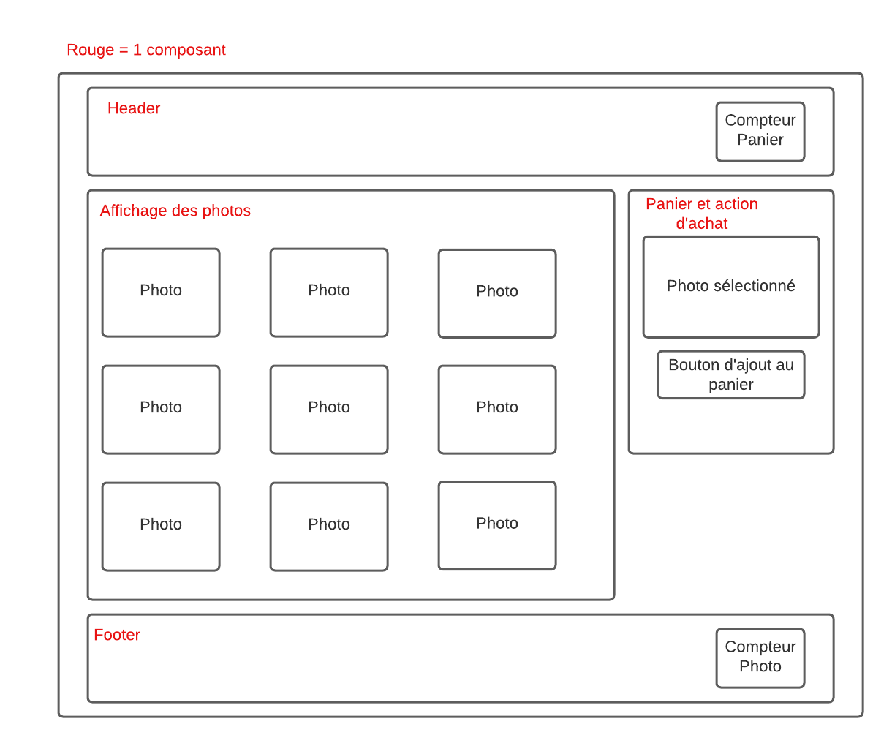

# Projet Fyc : TP Micro Front End

## Prérequis

Pour réaliser ce tp il vous faut :
- npm
- create-single-spa

## Installation

Pour installer les dépendances du projet, il faut lancer les commandes suivantes dans le répertoire display-button, display-image, home-root, nav et spore-acrions:

```bash
npm install
npm run build
npm run serve
```
## Sujet du Projet

### Contexte

La société FycProduction a décidé de réaliser un site web pour présenter les différents tickets de la société est ce avec une Architecture Micro Front End.

Suite à un précédent projet où les clients avaient demandé de réaliser un projet back-end avec une architecture micro service.
Enthousiaste par cette nouvelle technologie, la société vous a missionné pour réaliser un projet similaire, mais cette fois-ci, 
avec une architecture micro front end. L'entreprise n'étant qu'à ses débuts dans ce genre d'architecture, elle vous a demandé
de réaliser un projet simple mais qui permettra de montrer les avantages de cette architecture.


### Objectifs
L'objectif de ce projet est de réaliser un site web SPA avec Single-Spa.

Le concept est simple, à l'aide de Single-SPA et du module fédération, vous devez mettre en place une architecture microL'objectif de ce projet est de réaliser un site web SPA avec Single-Spa.

Le concepte est simple, à l'aide de Single-SPA et du module fédération, vous devez mettre en place une architecture micro front end
qui permette d'afficher un site web d'une seul page (single page application ou Single Single Page Application) qui affiche
une liste de photo de train. Chaque photo doit être cliquable et doit permettre d'afficher la photo dans une card "Panier" qui 
sera constintué de la derniere photo cliqué et d'un bouton "Acheter" qui permettra d'acheter d'ajouter +1 au compteur d'achat.
Ce compteur sera situé dans le header de la page. Pour finir, la page doit aussi avoir un footer qui affiche le nombre de photo.

Voci un exemple de ce que doit ressembler le site web :
front end qui permette d'afficher un site web d'une seule page (single page application ou Single Single Page Application)
qui affiche une liste de photo de train. Chaque photo doit être cliquable et doit permettre d'afficher la photo dans une card
"Panier" qui sera constitué de la dernière photo cliqué et d'un bouton "Acheter" qui permettra d'acheter d'ajouter +1 au compteur
d'achat. Ce compteur sera situé dans le header de la page. Pour finir, la page doit aussi avoir un footer qui affiche le nombre de photo.

Voici un exemple de ce que doit ressembler le site web :


### Consignes

L'architecture du projet doit être la suivante :
- Le projet doit être composé au minimum de 4 micros front end :
  - Header / Footer
  - Panier (affichage photo cliquée et bouton acheter)
  - Affichage Photos
  - Store (pour la logique d'achat)
- Un module root faisant la liaison entre les Micros FrontEnds
  Spécification impérative pour réaliser ce projet :
- Le projet doit être réalisé avec Single-Spa
- Le choix des framework utilisé pour chaque composant est libre (l'utilisation de framework sera un plus)
- La liste des photos doit être stockée dans le module root (Un exemple de liste de photo est fourni dans le fichier [./docs/ticket.js](./docs/ticket.js)).
  La liste des photos est à titre d'exemple et vous êtes libre de stocker les images en dur dans le module root plutôt que de les afficher via un lien comme dans le mock fournit.
- Toute la logique d'achat doit se trouver dans le module store. C'est ce module qui doit contenir la logique de compteur  d'achat.
- Hedear et Footer doivent être des composants utilisable indépendamment entre eux, vous pouvez les placer dans le même module ou dans des modules différents

Pour récapituler le minimum d'interactions nécessaires entre les différents modules (ceux-ci sont les limites minimum a réaliser, il y a probablement d'autres interactions qui ne sont pas citées ...) :
- Home doit exposer la liste des photos
- Le Header doit communiquer avec le store pour le compteur du panier.
- Le Footer doit communiquer avec le root pour le compteur du nombre de photo.
- La logique pour set la photo doit être dans le module Affichage Photos et ne doit pas communiquer avec le module Panier
- Le module Panier doit communiquer avec le module Store pour l'achat.
