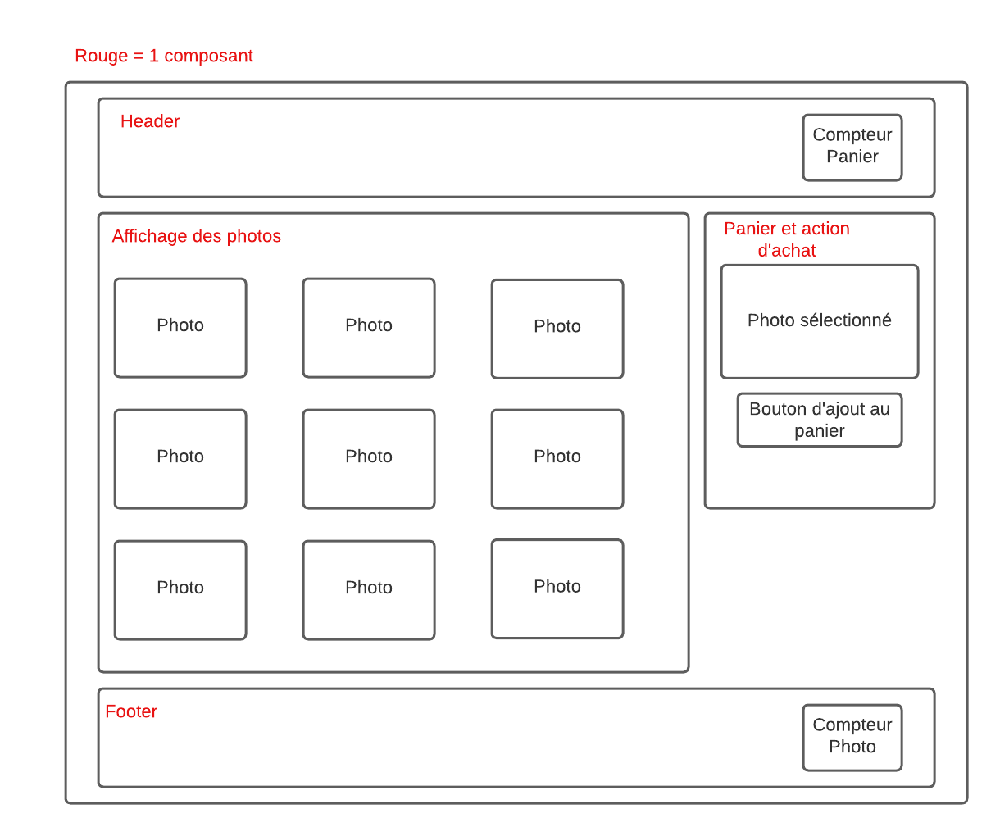

# Projet Fyc : TP Micro Front End

## Prérequis

Pour réaliser ce tp il vous faut :
- npm
- create-single-spa

## Sujet du Projet

### Contexte

La société FycProduction a décidé de réaliser un site web pour présenter les différents ticket de la société est ce avec
une Architecture Micro Front End.

Suite a un précédent projet où les clients avait demander de réaliser un projet back-end avec une architecture micro service. 
Enthousiasté par cette nouvelle technologie, la société vous a missionné pour réaliser un projet similaire mais cette fois-ci
avec une architecture micro front end. L'entreprise n'étant qu'a ses débuts dans ce genre d'architecture, elle vous a demandé
de réaliser un projet simple mais qui permettra de montrer les avantages de cette architecture.

### Objectifs
L'objectif de ce projet est de réaliser un site web SPA avec Single-Spa.

Le concepte est simple, à l'aide de Single-SPA et du module fédération, vous devez mettre en place une architecture micro front end
qui permette d'afficher un site web d'une seul page (single page application ou Single Single Page Application) qui affiche
une liste de photo de train. Chaque photo doit être cliquable et doit permettre d'afficher la photo dans une card "Panier" qui 
sera constintué de la derniere photo cliqué et d'un bouton "Acheter" qui permettra d'acheter d'ajouter +1 au compteur d'achat.
Ce compteur sera situé dans le header de la page. Pour finir, la page doit aussi avoir un footer qui affiche le nombre de photo.

Voci un exemple de ce que doit ressembler le site web :

### Consignes

L'architecture du projet doit être la suivante :
  - Le projet doit être composé au minimum de 4 micro front end :
    - Header / Footer
    - Panier (affichage photo cliqué et bouton acheter)
    - Affichage Photos
    - Store (pour la logique d'achat)
  - Un module root fesant la liason entre les Micros FrontEnds
Spécification impératif pour réaliser ce projet:
  - Le projet doit être réalisé avec Single-Spa
  - Le choix des framework utilisé pour chaque composant est libre (l'utilisation de framework sera un plus)
  - La listes des photos doit être stocké dans le module root (un exemple de liste de photo est fourni dans le fichier [ticker.js](./docs/ticket.js)).
La liste des photos est a titre d'exemple et vous êtes libre de stocker les images en dure dans le module root plutot que de url
les afficher via un lien comme dans le mock fournit.
  - Toutes la logique d'achat doit se trouver dans le module store. C'est ce module qui doit comptenir la logique de compteur
    d'achat.
  - Hedear et Footer doivent être des composants utilisable indépendament entre eux, vous pouvez les placer dans le meme module ou
dans des modules différents

Pour récapituler le minimum d'intéractions nécéssaires entre les différents modules (ceci sont les limites minimum a réaliser, il y a probablement d'autres intéractions qui ne sont pas cité ...) :
- Home doit exposer la liste des photos
- Le Header doit communiquer avec le store pour le compteur du panier
- Le Footer doit communiquer avec le root pour le compteur du nombre de photo
- La logique pour set la photo doit être dans le module Affichage Photos et ne doit pas communiquer avec le module Panier
- Le module Panier doit communiquer avec le module Store pour l'achat
